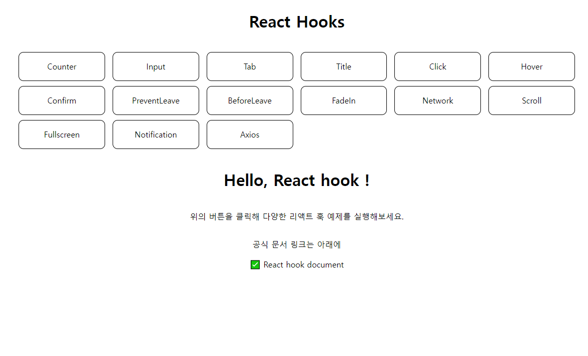
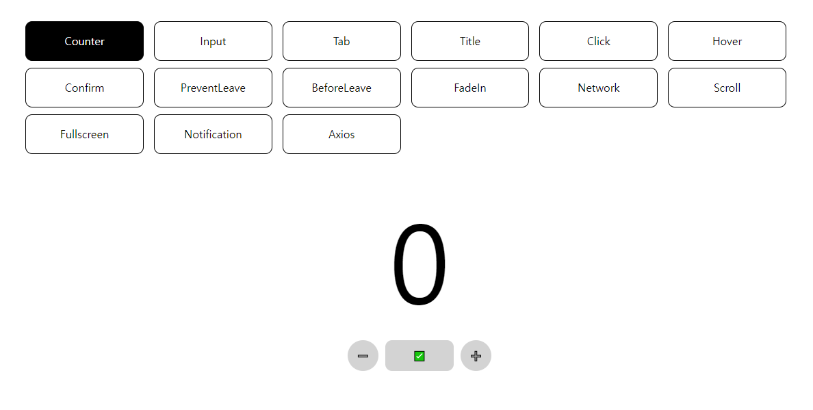

사용 방법
===
다운로드 및 패키지 설치
---
* ### 다운로드

```PowerShell
git clone https://github.com/basalcode/react-hooks.git
```
* ### 패키지 설치
```PowerShell
npm install

또는

yarn
```
시작하기
---
```PowerShell
npm run start

또는

yarn start
```

localhost:3000 으로 실행합니다.<br />
<br />
다음과 같은 화면이 나오면 성공!<br />

<br />

예시
---

버튼을 눌러서 React의 다양한 hook을 사용할 수 있습니다.

<br />

> 참조 링크: https://nomadcoders.co/react-hooks-introduction<br />